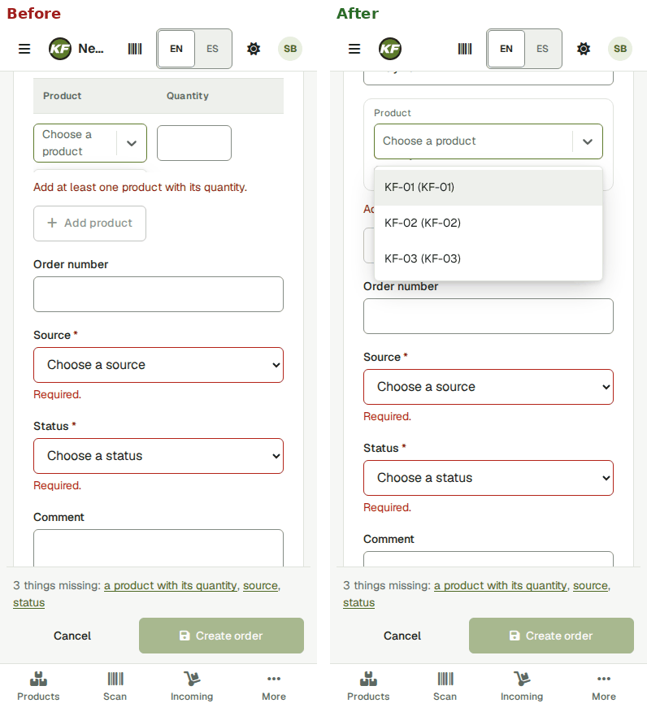
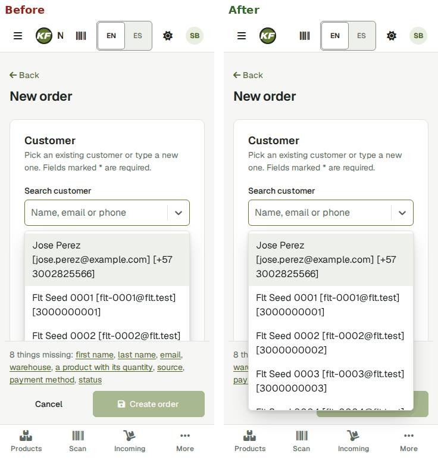
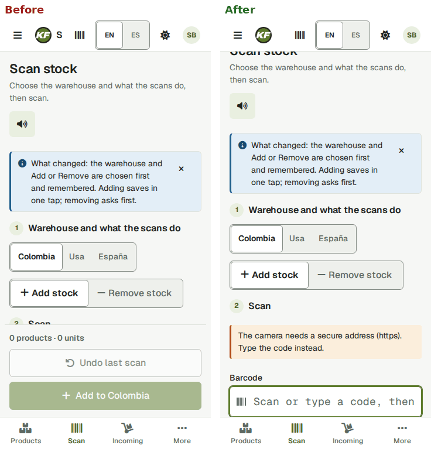
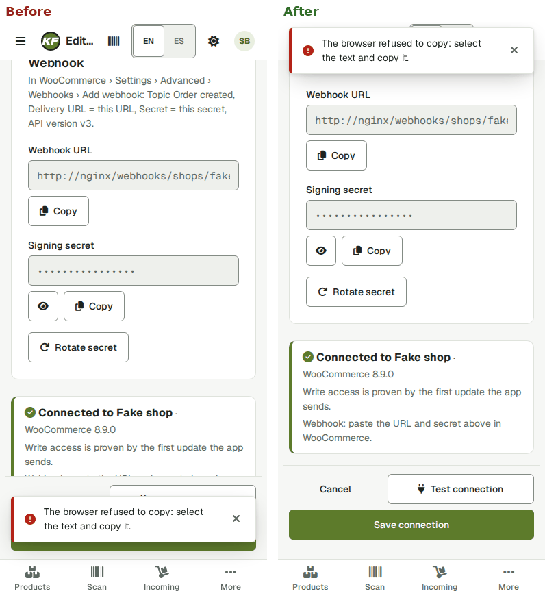
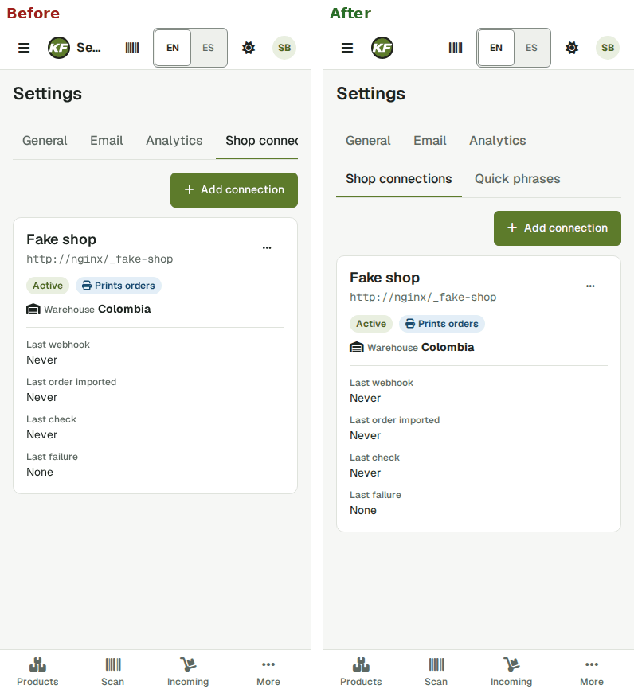
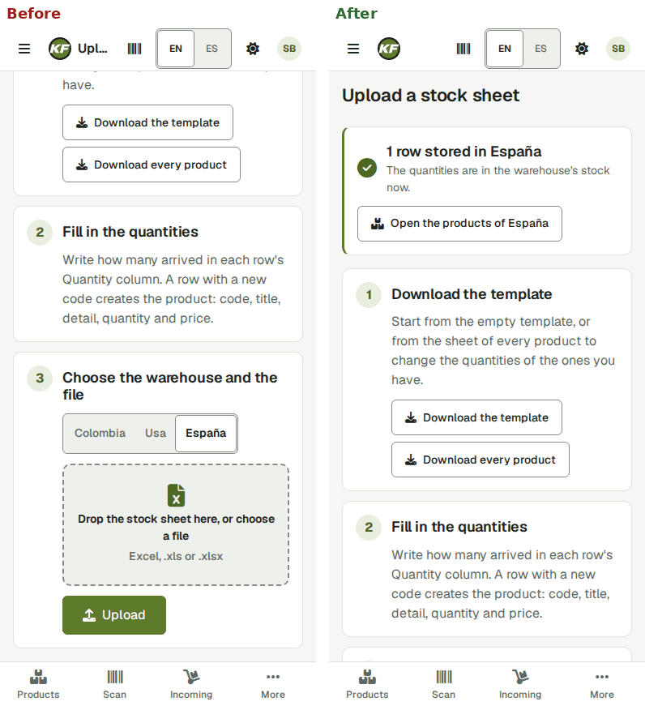
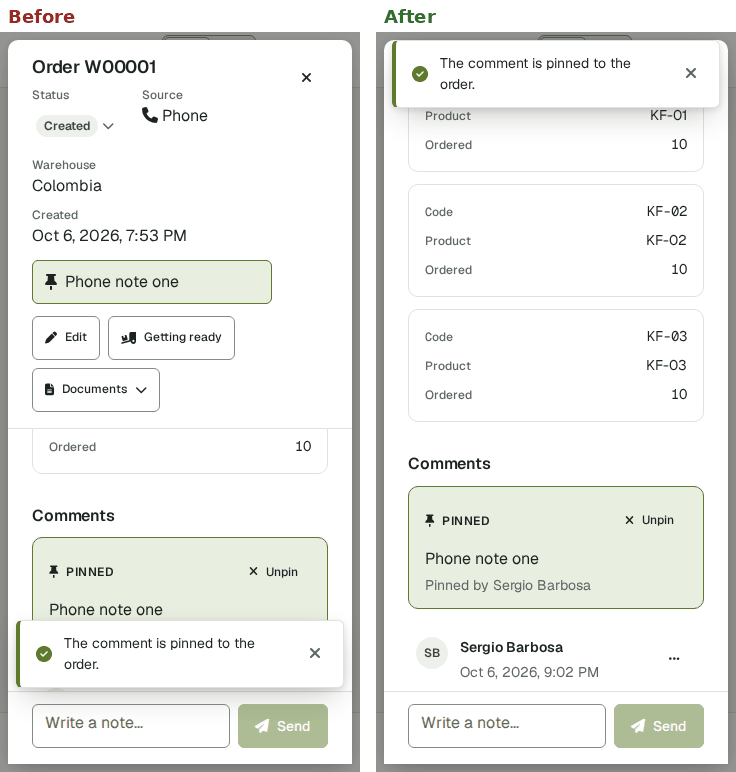
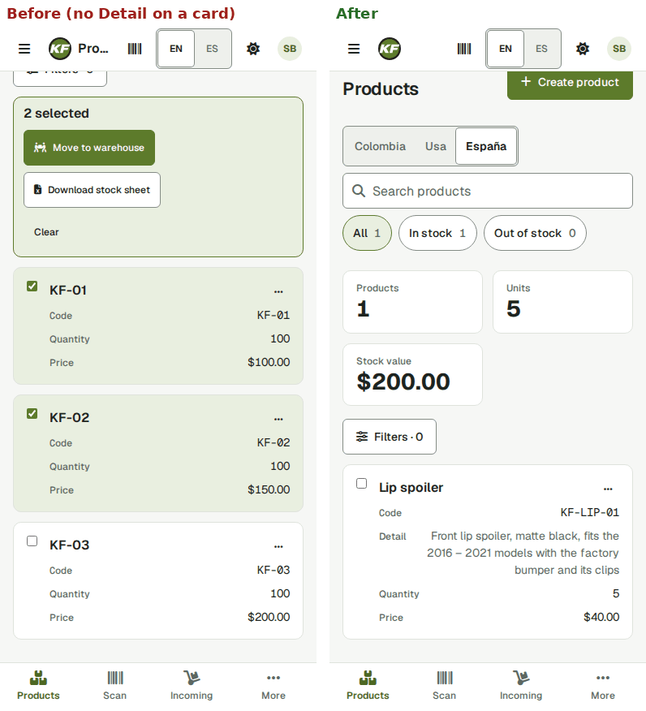

# Mobile pass — 2026-10-07

Can every role do its real jobs on a phone, with a finger? Not how the screens look (section 14's sweep checks
sideways scroll, raw keys, 44 px targets and console errors on every screen) but whether each step can be **done**:
the control reached with a tap, not hidden under the tab bar, an action bar, a sticky header or a toast, not cut off,
no hover needed, dialogs and menus that fit or scroll, fields not covered.

- **Branch:** `feature/mobile-pass` (from `origin/main` `65b87ff`), on this checkout's stack.
- **How:** Playwright with `isMobile: true, hasTouch: true`, portrait, `tap()` only, at **390 × 844** and **360 × 740**,
  signed in as each role: an exploration pass page by page (a screenshot and a "can a finger hit it?" probe at each
  step), then the fixes, then every flow written down as a smoke case: section 15 of
  [`ui-regression.md`](ui-regression.md), **MOB-01 – 20**, one test each in `backend/e2e/mobile.spec.ts`, its own lane
  (`mobile`, last and alone, one browser per role, about 2 minutes). Spanish was spot-checked on the screens with the
  longest labels (MOB-19).
- **What counts as "in sight":** the element is inside the screen and `document.elementFromPoint` at its centre is the
  element (or its label): `backend/e2e/support/phone.ts`, `expectInSight` / `expectReachable`.
- **Roles:** admin `sbarbosa115`, inventory clerk `inventory`, sales clerk `sales`, invoice clerk `invoices`.

## Result, page by page

Works = done with taps alone, nothing in the way, at both sizes. Fixed = it could not be done (or only by guessing)
before the commit named; the case now proves it.

| Page | Role | Job | Result | Case |
|---|---|---|---|---|
| Sign in | everyone | Username, Password, Sign in; a wrong password | Works | MOB-01 (AUTH-02 at desktop) |
| Top bar | admin | Menu, Open the reader, EN/ES, theme menu, account menu › Sign out | Fixed (`b2d7648`): the title was squeezed to "P…" / one letter beside the buttons; now hidden under 480 px (the page heading names the page) | MOB-01 |
| Tab bar, More drawer | admin, inventory, invoices | Go to each section; More lists the rest and closes after a choice; Menu › Close the menu | Works | MOB-01, MOB-20 |
| Back | admin | The page's Back link; the browser's back | Works | MOB-01 |
| Page titles | everyone | h1 and the tab's "<page> · KF Inventory" | Works | MOB-01 |
| Products | admin | Filters · N sheet (filter by code, sort), Show N results | Works | MOB-02 |
| Products | admin | The whole Detail on the card (the approved change); Stock value kept | Fixed (`9dd6596`): Detail was cut at 28 ch with "…" and missing from the cards | MOB-02 |
| Products | admin | Card ⋯ menu › Edit / Download stock sheet; a card's title opens the product; edit, Save | Works | MOB-02 |
| Products | admin, Spanish | Tick cards; the selection bar: Move to warehouse, Download stock sheet, Clear | Fixed (`93bb4e2`): above the list, the bar appeared under the tab bar when a card low on the screen was ticked (360 × 740) | MOB-03, MOB-19 |
| Products | admin | Move to warehouse: the centred panel fits, its list scrolls, Move / Cancel in sight | Works | MOB-03 |
| Product form | admin | Create product, what is missing, Save above the tab bar | Works | MOB-04 |
| Upload a stock sheet | admin, inventory | Template links; the drop zone opens the file picker; Upload | Fixed (`740f21f`): the result ("1 row stored in …") appeared above, out of sight, after tapping Upload at the bottom | MOB-05 |
| Incoming | admin | Approve all › confirm | Works | MOB-06 |
| Warehouses | admin | Rename by tapping the name; Save / Cancel | Works | MOB-06 |
| Scan | admin, inventory | Warehouse and mode, type a code, remove a line, step a quantity, Undo, Add | Fixed (`de85ba5`): the Barcode box sat under the sticky action bar (and, at 360 × 740, the tab bar), focused but out of sight | MOB-07, MOB-19 |
| Scan | admin | The camera without https: the "needs a secure address" note, typing still works | Works | MOB-07 |
| Orders | admin | Warehouse, status chips, Filters sheet, search | Works | MOB-08 |
| Orders | admin | A card's status menu › confirm (Cancel, and a change) | Works | MOB-08, MOB-09 |
| Order panel | admin | Open from a card; Edit, Getting ready, Documents menu, Close; scrolls inside | Works; improved (`beed998`): its facts, pinned note and actions took about half of the panel at 360 × 740, they now scroll with the body | MOB-08 |
| Comments | admin | Write box, Enter / Send, quick phrase chip, ⋯ › Pin, Unpin | Fixed (`a1fa0f2`, `be60391`): the new note stopped under the write box; the "pinned" toast covered the write box and Send | MOB-10 |
| Order form | admin | Customer picker, product lines (add, remove), missing-fields line, Create, Update order | Fixed (`8426847`, `094dce9`, `c3b2177`): **no product could be picked** (the lines table scrolled sideways under 1024 px and cut the picker's list to a sliver); the customer list opened under the action bar; a field named by the missing line could stop under the bar | MOB-09, MOB-19 |
| Getting ready | admin | Scan box, steppers, Ship N products | Works | MOB-11 |
| Customers | admin | Pages, Filters sheet, create with Country / State / City pickers, delete | Fixed (`c3b2177`, `094dce9`): Save with a required field empty seemed to do nothing (the message was above, out of sight); picker options were 40 px | MOB-12 |
| Invoices | sales | Filters sheet, the panel and Open PDF, create with a line picked by touch | Works | MOB-13 |
| Invoices | invoices | List, a card opens the panel, Open PDF | Works | MOB-20 |
| Users | admin | Status chips, create, roles ticked by tapping, password Show / Hide | Works | MOB-14 |
| Settings › tabs | admin, Spanish | Reach every tab | Fixed (`c0a0a89`): "Shop connections" was cut and "Quick phrases" off the edge (the open tab too, on a link to it) | MOB-15, MOB-19 |
| Settings › Email | admin | Send test email panel: Send to, Send, the answer, Close | Works | MOB-15 |
| Settings › Analytics | admin | The two IDs, Save | Works | MOB-15 |
| Settings › General | admin | Read it | Works | MOB-15 |
| Shop connections | admin | Card ⋯ menu; the form's Copy buttons, Test connection, Save connection | Fixed (`be60391`): the "browser refused to copy" error toast (it stays) covered Save connection and Test connection | MOB-16 |
| Quick phrases | admin | Add, move up, switch off, delete | Fixed (`be60391`): the "Phrase added." toast covered the new row's buttons | MOB-17 |
| Failed deliveries | admin | List, the panel, Retry, Discard | Works | MOB-18 |
| Orders › More › Check now | admin | Check now and its answer | Works | MOB-18 |
| Camera scanning | inventory | Read a label with the camera | Not covered: the dev stack is plain http, the camera needs https (see "Check on a real phone") | — |

## Problems found, and their fixes

Each is a kit-level change when more than one page had it. The screenshots are before | after, from the exploration
pass.

1. **The order form could not take a product on a phone (or a tablet).** `bootstrap-overrides.css` makes every
   `.table` scroll sideways under 1024 px; the product lines are such a table, and its overflow cut the product
   picker's list to a 5 px sliver: no option could be tapped. The lines table never scrolls now, and on a phone a line
   is a small card (the picker the full width, its list as wide; quantity and remove under it). `8426847`, MOB-09.
   
2. **Pickers opened under the bars.** react-select's list (z-index 100) went under a form's sticky action bar (200)
   and the tab bar: the customer list on the order form showed three options, the rest hidden. Lists now open over
   the bars, and their options are 44 px on touch. `094dce9`, MOB-09, MOB-12.
   
3. **The scan box was out of sight on the Scan page.** Below the warehouse, mode and camera note, it sat under the
   sticky action bar (Undo / Add, disabled until something is scanned) and at 360 × 740 under the tab bar too, while
   holding the focus. The action bar stays in the page's flow until something is scanned (`ActionBar sticky`),
   choosing the warehouse or the mode brings the box up, and the first scan puts it on top (sticky, as on Getting
   ready) with the list under it. `de85ba5`, MOB-07.
   
4. **Toasts covered the thumb's next action.** At the bottom on a phone, a toast lay over the order panel's write box
   and Send (after Pin), the quick phrase row just added, and a form's Save; an error toast stays until closed (the
   shop form's "refused to copy"). On a phone toasts now come down from the top. `be60391`, MOB-07, MOB-10, MOB-16,
   MOB-17.
   
5. **A refused save seemed to do nothing.** Save is at the bottom of a phone's screen; when the server marked a field
   (the customer's required phone), its message was above, out of sight. `FormLayout` now focuses the first field a
   save marks invalid and brings it to the middle of the screen (every form built on it). The root's scroll padding
   also clears the top bar, the tab bar and a sticky action bar (ActionBar shares its height), so a field the
   browser scrolls to (a missing-fields link, Tab) never stops under them. `c3b2177`, MOB-09, MOB-12.
6. **The selection bar went under the tab bar.** Above the list, ticking a card low on a 360 × 740 screen put the
   bar's actions under the tab bar. On a phone it now floats above the tab bar like a form's action bar (count and
   Clear on one line, the actions on the next), and the page keeps room for it. `93bb4e2`, MOB-03, MOB-19.
7. **Settings' tabs scrolled out of sight.** "Shop connections" was cut and "Quick phrases" past the edge, with no
   hint, and a link to Quick phrases opened with its tab invisible. They wrap to a second line on a phone. `c0a0a89`,
   MOB-15, MOB-19.
   
8. **The upload result was out of sight.** It appears above the three steps, Upload below them: tapping Upload at the
   bottom showed nothing. It is brought into view. `740f21f`, MOB-05.
   
9. **A new note stopped under the write box.** It was scrolled to the bottom edge of the order panel, where the
   sticky write box covers it; entries now keep a margin of the box's height. `a1fa0f2`, MOB-10.
10. **The order panel's header took half the panel at 360 × 740.** Facts, the pinned note and the actions were fixed
    under the title, leaving a strip for the products and the comments. On a phone only the title and × stay; the
    rest scrolls with the body (`SlideOver`'s `header` content has its own part). `beed998`, MOB-08, MOB-10.
    
11. **The top bar title was one letter.** At 360 px the buttons left "P" or "S". Hidden under 480 px; the page's
    heading names it. `b2d7648`, MOB-01.
12. **The approved change: Products' Detail in full.** Cut at 28 ch with "…" and absent from the phone cards; it now
    wraps in full on the list and is a fact of every card (code, detail, quantity, price); Stock value stays.
    `9dd6596`, MOB-02, `StockTable.test.tsx`.
    

Tests written first: Vitest where jsdom can show it (`StockTable`, `ScanStock`, `FormLayout` / `ActionBar`,
`UploadProductsForm`, `SlideOver`, `DataTable`), and for the layout-only ones the MOB cases, which were run against the
unchanged UI first: 13 of 20 failed there, nine for the problems above (the top bar title, the card detail, the
upload result, the scan box, the customer list under the bar, the required phone out of sight, the settings tabs, the
toast over Save, the Spanish scan box), three because an earlier case had not made their data, and one (MOB-03)
because of a helper of the test itself, fixed before the fixes were run.

## Seen, not changed

- **An invoice clerk's Create invoice asks for a warehouse's stock and gets 403** (two console errors): the form reads
  stock, which needs `ROLE_MANAGE_INVENTORY` (why the fixtures have `sales`). Not a phone issue; the roles are
  production's. MOB-20 opens an invoice instead; MOB-13 creates one as `sales`.
- **Check now on the dev stack could deadlock** when tapped while the Orders page was still loading: the pull asks the
  fake shop, served by the same five PHP workers, and holds the session lock the page's requests wait on. Dev only
  (production's shops are not served by the app); SHOP-08 and MOB-18 now wait for the list (`65509e1`). The run file's
  "Smoke findings" has the details.
- Every row checkbox is named "Select row" (not the product's code): a screen-reader matter, not a phone one.
- A card shows a fact's label with nothing after it when the value is empty (Detail of a product without one, a
  customer's City): the kit's way on every list.

## Check on a real phone

What Playwright's emulation cannot prove; to try once on an Android phone (Chrome) and an iPhone (Safari) against the
HTTPS site:

1. **The camera reads a label**: Scan and Getting ready, a printed Code 128 and a QR code, the torch, the beep and the
   vibration, the same label counted once; the permission prompt and what happens when it is refused.
2. **The on-screen keyboard**: typing in the Scan box, the order panel's write box and the order form; iOS Safari
   pushes the page up rather than resizing it: the action bar (Add to …, Ship, Create order) and the write box must
   still be reachable with the keyboard open, and come back when it closes.
3. **Pull-to-refresh and the browser's own bars**: pulling down on a list (Chrome reloads the page: nothing typed is
   lost?), the address bar hiding on scroll (the tab bar and the floating selection bar stay put).
4. **Add to home screen**: the KF icon (`apple-touch-icon.png`) and the name; it opens signed in (there is no PWA
   manifest or offline mode: what it does offline).
5. **A slow connection (3G)**: the skeletons while lists load, a save tapped twice, the upload of a large sheet.
6. **Safe areas**: an iPhone with a home indicator (the tab bar's `safe-area-inset-bottom`) and landscape on a phone.

## Verification

- Vitest: the whole suite, 85 files, 539 tests, green; `npm run -s typecheck` clean.
- `gate.sh --fix` (repository root): PASS (cs, PHPStan, Deptrac, Prettier, ESLint, tsc, compose CPUs, schema drift).
  No PHP was touched, so PHPUnit was not run.
- Smoke suite (`smoke.py`), recorded in [`runs/2026-10-06-mobile-pass.md`](runs/2026-10-06-mobile-pass.md): attempt 1
  not green (SHOP-08, a dev-stack race; the mobile lane skipped behind it), fixed in the test; then green (194 of 194).
